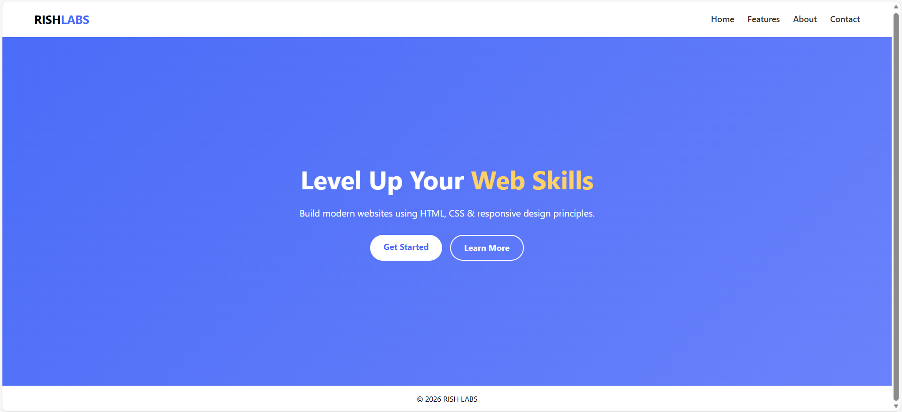

# project-1
This project is a clean and responsive landing page built as part of the Elevate Labs Web Development Internship.
The goal was to design a structured webpage with a header, hero section, and footer using modern CSS techniques.

# Technologies Used
- HTML5 (Semantic Structure)
- CSS3
- Flexbox
- Media Queries (Responsive Design)

# Features
- Modern UI with gradient hero section
- Responsive navigation bar
- Call-to-action buttons with hover effects
- Mobile-friendly layout
- Clean and structured code

##  Project Preview

